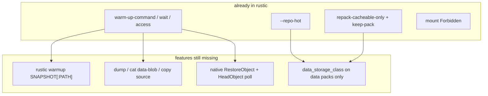

# AWS Glacier in rustic

| Field | Value |
|---|---|
| **Author** | rustic maintainers |
| **Date** | 2026-09-02 |
| **Status** | Implemented on `feat/aws-glacier` |
| **Audience** | rustic maintainers |

This is a rustic product plan. It is not a port of restic’s Glacier PR series. No `trees/` vs `data/` split, no restic format 3, no restic feature flags.

---

## Overview

rustic should treat AWS Glacier / Deep Archive / Glacier Instant Retrieval as **cold storage for backup payload**, with **hot metadata** so daily commands never call RestoreObject.

That product already exists in rustic as `--repo-hot` plus the warmup and prune knobs. `feat/aws-glacier` adds AWS-native RestoreObject (so users are not required to wrap `aws s3api restore-object`) and optional per-object storage class on a single bucket.

**Primary architecture:** two backends (`--repo-hot`). Cold holds everything; hot holds metadata and tree packs. Reads of metadata never touch Glacier.

**Optional:** one S3 bucket, data packs uploaded with a Glacier class, metadata left Standard. Still no path split.

---

## Features we want

| # | Feature | Why | Status |
|---|---|---|---|
| F1 | **Hot metadata, cold payload** | `backup`, `snapshots`, `ls`, `forget`, `diff`, `find`, `tag`, `key` must work without RestoreObject | **Done** (`--repo-hot`) |
| F2 | **Cheap archive classes for data packs** | `GLACIER`, `DEEP_ARCHIVE`, `GLACIER_IR` for file contents only | **Done** (`data_storage_class` on data packs only; do not set OpenDAL `default_storage_class`) |
| F3 | **Start restore of every needed pack, then wait or leave** | Deep Archive is 12–48h. Fire all RestoreObject jobs in one shot; come back later | **Done** (`rustic warmup`, `restore --warmup-only`) |
| F4 | **Prune that does not rewrite mixed Glacier packs** | Repack = retrieve + PUT + early-delete fees (90/180 day minimum) | **Done** on `--repo-hot` (`repack_cacheable_only`, `--keep-pack`); also when `archive_class()` is set |
| F5 | **Mount / WebDAV must not hang for hours** | FUSE `open` cannot block on RestoreObject | **Done** as default Forbidden on hot/cold |
| F6 | **dump / cat / copy of file contents** | Same pack set as restore; must warm first | **Done** |
| F7 | **Native AWS RestoreObject** | `--warm-up-command` works but is a shell script per user | **Done** (`enable_restore`; reqwest sidecar) |
| F8 | **Confirm packs are actually readable** | `--wait` today is a sleep, not a HeadObject poll | **Done** (`warmup --status`, `--require-warm`, HeadObject poll) |

Non-features:

- Legacy Glacier vault API.
- Repo format change (`trees/` prefix). Tree vs data is already a pack-type split (`BlobType::is_cacheable`). Lifecycle-on-prefix `data/` is unsupported; use `--repo-hot` or per-object class at PUT.
- Pure split-repo (metadata only on hot). Cold must remain a complete rustic/restic repo.
- On-demand per-file warmup inside FUSE.
- Replacing OpenDAL with a custom S3 backend.
- Waiting on restic.

---

## What rustic already does

### F1 — `--repo-hot`

`HotColdBackend` (`rustic_core/crates/core/src/backend/hotcold.rs`):

```
is_hot = cacheable || tpe != Pack   (config is special-cased)

Save metadata → hot then cold
Save data packs → cold only
Load metadata → hot
Load data packs → cold (read_partial)
Warmup → cold
```

Tree packs are `cacheable` (`BlobType::Tree` in `blob.rs`). CLI: `repo-hot` / `RUSTIC_REPO_HOT` in `rustic_core/crates/backend/src/choose.rs`. Hot config has `is_hot = Some(true)`; cold config clears it. Losing hot: omit `--repo-hot` and open cold (`open_only_cold` already warms keys+config).

Tests: `rustic_core/crates/core/tests/integration/hotcold.rs`, `rustic/tests/check_hot_cold.rs`. Profile: `rustic/config/services/rclone_ovh-hot-cold.toml`.

### F3 (partial) — warmup plumbing

`RepositoryOptions` already has (`repository.rs`):

- `--warm-up` — 1-byte `read_partial` via `WarmUpAccessBackend` (OVH)
- `--warm-up-command` with `%id` `%path` `%ids` `%paths` `%tpe`, `--warm-up-batch`
- `--warm-up-wait` duration **sleep**
- `--warm-up-wait-command`

`warm_up` (`repository/warm_up.rs`): command wins; else `be.needs_warm_up()` then `be.warm_up`. OpenDAL currently never sets `needs_warm_up()`.

Callers of `warm_up_wait` today: restore (`RestorePlan::to_packs()`), prune (repack set), `check --read-data`, repair index, repair hotcold, `open_only_cold` (keys+config). **Not** dump, cat, copy.

### F4 — prune

`repack_cacheable_only` defaults to **true** when `repo.config().is_hot == Some(true)` (`prune.rs` ~740). Mixed data packs are kept. Fully unused packs are still deleted. `--keep-pack 90d`/`180d` already gates repack/delete by age (restic does not have this yet).

Do not change the `keep_pack` default (`0d`). Document `90d`/`180d` in the Glacier profile.

### F5 — mount / WebDAV

When `is_hot == Some(true)`, default `FilePolicy::Forbidden` (`mount.rs`, `webdav.rs`). FUSE `open` returns `ENOTSUP`. Users who have warmed a snapshot set `file-access = "read"`.

### Pack layout (unchanged)

All packs stay under `data/<ab>/<id>` (`FileType::Pack.dirname()`, `OpenDALBackend::path`). Tree vs data is the `cacheable` bit, not a directory.

---

## Gaps



OpenDAL 0.58.1 (`rustic_backend` pin):

| Need | OpenDAL |
|---|---|
| Backend-wide `default_storage_class` including Glacier classes | Yes — **all** writes, including keys/trees |
| Per-write storage class | **No** (`WriteOptions` has no `storage_class`) |
| Glacier RestoreObject | **No**. `Operator::restore` is S3 **versioning** (delete-marker). Must not call it. |
| HeadObject `x-amz-restore` | Not exposed for this |

So F2 on a single bucket needs **two operators**. F7 needs a **reqwest sidecar**, not OpenDAL `restore`. `--warm-up-command` stays for OVH, rclone, and exotic AWS auth (SSO / assume-role / IMDS).

---

## Proposed design

### Supported recipes

**Recipe A — two backends (the product; works today after docs).** Local or Standard S3 as hot; Glacier/Deep Archive bucket as cold. Lifecycle may apply to the **entire cold bucket**. Do not lifecycle a prefix on a mixed bucket.

```toml
[repository]
repository = "opendal:s3"
repo-hot = "/var/lib/rustic-hot"
warm-up-command = "aws s3api restore-object --bucket my-glacier --key %path --restore-request Days=7,GlacierJobParameters={Tier=Standard}"
warm-up-wait = "48h"
warm-up-batch = 20

[repository.options]
bucket = "my-glacier"
root = "/repo"
region = "eu-central-1"

[prune]
repack-cacheable-only = true
keep-pack = "180d"
```

IAM on cold: `s3:GetObject`, `s3:PutObject`, `s3:DeleteObject`, `s3:ListBucket`, `s3:HeadObject`, `s3:RestoreObject`.

After native restore lands, drop the two `aws` lines and set `enable_restore = "true"` (plus `restore_days` / `restore_tier`) in `[repository.options]`. Prefer `data_storage_class` on cold so cold metadata stays Standard for recovery without `--repo-hot`.

**Recipe B — single bucket (needs per-object class).** No `--repo-hot`. Data packs uploaded Glacier; everything else Standard. Do **not** set OpenDAL `default_storage_class`. Do **not** lifecycle prefix `data/` (tree packs live there).

**Recipe C — OVH / rclone.** Unchanged: `warm-up = true`, `warm-up-wait = "10m"`. Native RestoreObject does not apply.

### F3 + F6 — `rustic warmup` and remaining readers

CLI matches restore/dump/mount: `SNAPSHOT[:PATH]`. Pack set = `node_from_snapshot_path` + `prepare_restore` + `RestorePlan::to_packs()`.

```
rustic warmup latest
rustic warmup latest:/etc
rustic warmup --wait latest
```

- Default: `Repository::warm_up` (initiate, return).
- `--wait`: existing `warm_up_wait`.
- restore `--warmup-only`: compute pack set, `warm_up`, exit.

dump, `cat data-blob`, and copy **source** call `warm_up_wait` on the pack set before reading. Other `cat` subcommands (tree, config, index, snapshot, key) do not need data-pack warmup.

No restic `--include`.

### F7 + F8 — native RestoreObject

New module next to OpenDAL (`rustic_core/crates/backend/src/s3_restore.rs`): **reqwest + SigV4**. Never `Operator::restore`. Never `aws-sdk-s3`.

Enable when scheme is `s3` and `[repository.options] enable_restore = "true"` (opt-in forever; it spends money and hours).

- Object key = `OpenDALBackend::warmup_path` (already includes operator `root`).
- Credentials **duplicated** from the OpenDAL option map + `AWS_*` env + `~/.aws/credentials`. `Operator::info()` does not expose secrets. SSO/assume-role/IMDS users keep `--warm-up-command`.
- POST `?restore`; HTTP **202** and **409 RestoreAlreadyInProgress** are success.
- HeadObject parses `x-amz-restore` / `x-amz-storage-class`. GET `InvalidObjectState` ⇒ cold (Intelligent-Tiering archive / lifecycle). Do not trust class list alone.
- `enable_restore` ⇒ `OpenDALBackend::needs_warm_up() == true`, except `GLACIER_IR` (instant; no RestoreObject).
- Command warmup still **overrides** if `warm_up_command` is set.
- Parallelism = OpenDAL `connections` (default 20, rustic’s existing warmup pool).
- Timeout: 48h if class is `DEEP_ARCHIVE`, else 24h. Fail with “increase `restore_timeout`”.
- Poll interval 60s; log `warm / warming / cold` counts.

`ReadBackend::warmup_status` default `Warm`. Native poll only when some id is not Warm. `WarmUpAccessBackend` does **not** override status, so OVH still sleeps `warm-up-wait`. Wrappers (`HotColdBackend`, cache, decrypt, dry-run) **forward** status to cold/inner.

`--status` and `--require-warm` come after `warmup_status` exists:

- `warmup --status`: no RestoreObject; exit 0 iff all Warm.
- `--require-warm` on restore/dump/cat/copy/check/prune/mount/webdav: no `warm_up`, no command; fail at **command start** if any pack is Cold/Warming.
- Mount/WebDAV with `file-access=read` and a cold pack: FUSE `EIO` + log `rustic warmup {snap}`; WebDAV `FsError::GeneralFailure`. Forbidden stays `ENOTSUP`.

### F2 — per-object class (two operators)

`write_bytes` ignores `_cacheable` today (`opendal.rs`). OpenDAL has no per-write class.

Ship path: two `Operator`s sharing the option map except `default_storage_class` on the **data-pack** operator.

Strip rustic-only keys before `via_iter` (same pattern as `retry`): `data_storage_class`, `enable_restore`, `restore_days`, `restore_tier`, `restore_timeout`. Keep `default_storage_class` in the map (real OpenDAL key; still a footgun if set without `--repo-hot` / this split).

| Write | Operator |
|---|---|
| `Pack && !cacheable` and `data_storage_class` set | data operator (Glacier class) |
| everything else | metadata operator (no archive class) |

Reads always use the metadata operator (class does not affect GET of a restored copy).

`GLACIER_IR`: class on data packs only; `needs_warm_up() == false`.

Required test: tree/snapshot/key/config writes do not get Glacier class; data-pack Put via data operator is Head/Get-able via metadata operator.

### F4 extension — prune without `--repo-hot`

`ReadBackend::archive_class() -> Option<&str>` default `None`. `OpenDALBackend` returns `data_storage_class` when it is `GLACIER` / `DEEP_ARCHIVE` / `GLACIER_IR`. `HotColdBackend` forwards to cold.

```rust
let repack_cacheable_only = opts.repack_cacheable_only.unwrap_or_else(|| {
    repo.config().is_hot == Some(true) || repo.be.archive_class().is_some()
});
```

Warn (do not skip) when deleting a pack younger than 90d / 180d. `--keep-pack` remains the hard gate. `--repack-data` = `repack_cacheable_only=false` and uses the same warmup path as restore.

Glacier knobs live in `[repository.options]` / `[repository.options-cold]` (`BTreeMap`). Not `RepositoryOptions` (`deny_unknown_fields`).

---

## API changes

```rust
// ReadBackend
fn warmup_status(&self, tpe: FileType, id: &Id) -> RusticResult<WarmupStatus> {
    Ok(WarmupStatus::Warm)
}
fn archive_class(&self) -> Option<&str> { None }

enum WarmupStatus { Cold, Warming, Warm, Lukewarm }
```

`Lukewarm` = restore copy expires within 24h → issue RestoreObject again to refresh days.

No repo JSON schema change. `FileType` stays five variants. Packs stay under `data/`.

---

## Alternatives considered

1. **Status quo (`--warm-up-command` only).** Keep as generic backend (OVH, exotic auth). Not enough for AWS-native UX (dump/cat still broken; class footgun).
2. **Custom S3 backend.** Reject. OpenDAL stays the data path.
3. **`trees/` path split.** Reject. Not needed for `--repo-hot` or PUT-time class. Lifecycle-on-`data/` is unsupported.
4. **Metadata only on hot.** Reject. Cold would not be a repo.
5. **`aws-sdk-s3` sidecar.** Reject. Large dep; still duplicates credentials. reqwest is already in `rustic_backend`.

---

## Security

- `enable_restore` opt-in forever.
- No implicit Expedited. Reject Expedited if **observed** HeadObject class is `DEEP_ARCHIVE`.
- Sidecar does not log secrets. Does not read `Operator::info()`.
- Do not CopyObject restored objects to STANDARD; AWS already yields a temporary copy.
- `extra_verify` stays on.

---

## Observability

Reuse warmup progress + JSON-lines `pack-progress` (`repository/warm_up.rs`). Native poll logs remaining counts. Timeout fails with a hint, it does not hang.

---

## Risks

| Risk | Severity | Mitigation |
|---|---|---|
| Two operators mis-route writes | High | Routing-table tests |
| Sidecar auth diverges (IMDS/SSO) | Medium | Document; `--warm-up-command` for exotic auth |
| Calling `Operator::restore` | High | Sidecar never touches it; test |
| Native poll skips OVH 10m sleep | High | Poll only if status is non-Warm |
| Early-delete fees | Medium | Document `--keep-pack`; warn via `archive_class()` |

---

## Key Decisions

1. **`--repo-hot` is the Glacier architecture.** Already implemented. Cold remains a complete repo.
2. **No `trees/` / format 3.** Tree vs data is `cacheable`. Lifecycle on prefix `data/` is not supported.
3. **Warmup CLI is rustic `SNAPSHOT[:PATH]`**, reusing `RestorePlan::to_packs`.
4. **Native RestoreObject is a reqwest sidecar**, opt-in `enable_restore`. Never `Operator::restore`.
5. **Per-object class is two OpenDAL operators**, not a layout change.
6. **Command warmup still wins** over native restore (OVH / rclone / exotic auth).
7. **Prune: do not rewrite mixed data packs** when `is_hot` or `archive_class()` is set. `keep_pack` default stays `0d`.
8. **Mount Forbidden → `ENOTSUP` stays.** New cold-pack error is `EIO` / WebDAV `GeneralFailure`. `--require-warm` fails at command start.
9. **Glacier options live in `[repository.options]`**, not `RepositoryOptions`.

---

## PR Plan

Each PR is independently mergeable. No restic dependency.

**Merge order:** P1 → P2 → P3, then P4 and P5 in parallel, then P6 → P7 → P8.

### P1 — Glacier profile (docs only)

- **Title:** Document Glacier / Deep Archive with `--repo-hot` and existing warmup/prune knobs
- **Files:** `rustic/config/services/s3_aws.toml`, new `s3_aws_glacier_hot_cold.toml`, `rustic/config/README.md`
- **Depends on:** none
- **Description:** Recipe A. IAM including `s3:RestoreObject`. Warn against `default_storage_class` on a single-bucket repo. `--keep-pack 90d`/`180d`.

### P2 — `rustic warmup` initiate / `--wait`

- **Title:** Add `rustic warmup <SNAPSHOT[:PATH]>` on existing warmup APIs
- **Files:** `rustic/src/commands.rs`, new `warmup.rs`, restore `--warmup-only`
- **Depends on:** none
- **Description:** Pack set from `RestorePlan::to_packs`. `--wait` calls existing `warm_up_wait`. No status API yet.

### P3 — dump, cat data-blob, copy source

- **Title:** Warm data packs before dump, cat data-blob, and copy-from-source
- **Files:** `rustic_core/crates/core/src/commands/{dump,cat,copy}.rs`
- **Depends on:** none
- **Description:** Blob→pack via index; `warm_up_wait`. Copy warms source only. `cat` only `DataBlob`.

### P4 — `warmup_status` and poll wait

- **Title:** Add `ReadBackend::warmup_status`; poll when status is non-Warm
- **Files:** `backend.rs`, wrappers (`hotcold`, `cache`, `decrypt`, `dry_run`, `warm_up`), `repository/warm_up.rs`
- **Depends on:** none
- **Description:** Default `Warm`. Native poll only if some id is not Warm. OVH duration-wait preserved. Unit-test the decision table.

### P5 — two-operator `data_storage_class`

- **Title:** Apply S3 archive class only to non-cacheable packs
- **Files:** `rustic_core/crates/backend/src/opendal.rs`, fixtures
- **Depends on:** none
- **Description:** Strip rustic Glacier keys. Two operators. Routing-table tests. Implement `archive_class()`.

### P6 — native RestoreObject

- **Title:** S3 Glacier RestoreObject + HeadObject via reqwest sidecar
- **Files:** new `s3_restore.rs`; wire from `opendal.rs`; `Cargo.toml` (`aws-sigv4`)
- **Depends on:** P4
- **Description:** `enable_restore` default false. Key = `warmup_path`. HTTP 202 success. Must not call `Operator::restore`. Fake HTTP tests. Generic over `FileType`.

### P7 — `--status` / `--require-warm`

- **Title:** Warmup `--status` and `--require-warm` on read commands
- **Files:** CLI warmup/restore/dump/cat/copy/check/prune/mount/webdav, `fusefs.rs`, `webdavfs.rs`
- **Depends on:** P4; P2; P3 (pack sets)
- **Description:** `--require-warm` fails at command start. Forbidden stays `ENOTSUP`. Cold pack + `file-access=read` → `EIO` / `GeneralFailure`.

### P8 — prune `archive_class()` default

- **Title:** Default `repack-cacheable-only` when an archive class is configured
- **Files:** `prune.rs`, CLI prune, docs
- **Depends on:** P5
- **Description:** Default true if `is_hot` **or** `archive_class().is_some()`. Alias `--repack-data`. Warn on young deletes. Changelog: behavior change for single-bucket Glacier without `--repo-hot`.
